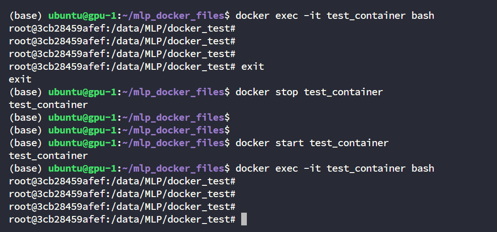

# Docker 

도커?: 독립된 환경에서 개발하기 위한 도구

우리는 GPU를 분리하기 위해 사용함

# 기본 개요 

```text
Dockerfile (설계도)
    ↓ (docker build)
Docker 이미지 (실행 파일)
    ↓ (docker run)
Docker 컨테이너 (실행 중인 프로그램)
```

## 1. Dockerfile

Dockerfile: docker 이미지를 만들기 위한 설정 파일 

현재 다음과 같은 dockerfile을 만들어 놓았음

```Dockerfile
FROM nvidia/cuda:12.1.0-cudnn8-devel-ubuntu22.04
ARG DEBIAN_FRONTEND=noninteractive
RUN apt update
RUN apt install -y git python3 python3-pip
RUN python3 -m pip install --no-cache-dir --upgrade pip

WORKDIR /data/MLP/docker_test
```

내용은 궁금하시면 찾아보면 될 것 같습니다. (중요하지 않음)

## 2. Docker image

```bash
(base) ubuntu@gpu-1:~/mlp_docker_files$ pwd
/home/ubuntu/mlp_docker_files

(base) ubuntu@gpu-1:~/mlp_docker_files$ ls
test_dockerfile

(base) ubuntu@gpu-1:~/mlp_docker_files$ cat test_dockerfile 
FROM nvidia/cuda:12.1.0-cudnn8-devel-ubuntu22.04
ARG DEBIAN_FRONTEND=noninteractive
RUN apt update
RUN apt install -y git python3 python3-pip
RUN python3 -m pip install --no-cache-dir --upgrade pip

WORKDIR /data/MLP/docker_test
```

(pwd, ls, cat 명령어는 매일 사용하실 ubuntu 명령어니까 찾아보시면 좋을 것 같습니다. 중요함)


### 2.1 docker image 빌드

`test_dockerfile`이라는 Dockerfile이 있을 때, 다음의 명령어로 docker image 빌드 가능.

```sh
docker build -f [Dockerfile name] -t [Docker image name] .
```

`[Dockerfile name]` 에는 위에서 만든 dockerfile인 `test_dockerfile`이 들어감. 

`[Docker image name]`에는 만들고자 하는 docker image의 이름을 넣으면 됨.


### 2.2 빌드된 image 확인

```
docker images
``` 

혹은 

```
docker image list
```

명령어를 통해 빌드되어있는 image의 리스트를 확인할 수 있음.


## 3. 컨테이너 생성, 실행, 접속

### 3.1 컨테이너 생성
```sh
docker create -it --gpus device=[gpu number] --name [container name] [image name]
```

`run` 명령어를 통해 컨테이너 생성 및 실행

`[gpu number]`에는 2, 3, 4, 5등 사용할 gpu 번호 입력 (**!!중요!!** 본인 할당받은 GPU 번호만 입력)

`[container name]`에는 생성할 container 이름 입력

`[image name]`에는 `docker images` 명령어를 쳤을 때 나오는, 본인이 빌드한 도커 이미지 입력


#### 3.1.1 생성된 컨테이너 확인 

`docker ps -a` 명령어를 통해 생성된 컨테이너 확인 


오른쪽 끝의 NAMES를 보면 `test_container`가 있는 것을 확인할 수 있음.

그리고 해당 이미지는 "created" 상태

### 3.2 컨테이너 실행

```bash
docker start [container name]
```

`[container name]`에는 컨테이너 이름 입력 

```bash
docker start test_container
```

이제 `docker ps -a`를 쳐보면 Status가 `Up`으로 변경된 걸 확인 할 수 있음.


### 3.3 컨테이너 접속
```bash
docker exec -it [container name] bash
```


컨테이너에 접속함

## 4. 컨테이너 나가기, 종료, 삭제

나가기: 컨테이너 내부에서 `exit` 입력

종료: exit으로 나가지면, `docker ps -a`로 실행중인 컨테이너 삭제한 뒤, 본인의 컨테이너 이름에 맞춰서 `docker stop [container name]` 입력 

삭제: `docker rm [container name]` 입력 


> 컨테이너 삭제는 더이상 해당 컨테이너를 쓰지 않을 것 같을 때 하면 됩니다.
일반적으로는 그냥 나가기 및 종료를 한 다음, 다시 `docker start [container name]`을 하시면 됩니다.




이렇게 도커에 들어오면 이제 지정한 GPU만 독립적으로 보이게 됩니다.


# VSCode에서 docker 사용 

> 컨테이너가 실행되고 있어야 함

## 1. VSCode 좌측의 extensions 탭에 "dev container" 입력


## 2. Install dev container


## 3. VSCode 좌측의 Remote explorer에서 Dev containers 클릭


## 4. 본인이 만든 container에 attach


## 5. Open folder에서 "/data/MLP/[dir name]" 입력


> 꼭!!! /data/MLP/ 위에 만들어지는 디렉토리에서 작업하셔야합니다.


# 숙제 

각자의 gpu번호에 맞는 Dockerfile을 사용해서 

1. 이미지 빌드

2. 컨테이너 생성

3. 컨테이너 실행

을 해보신 뒤, VSCode로 Docker에서 작업해보세요

기존에 있던 이미지는 다 지워놨습니다
